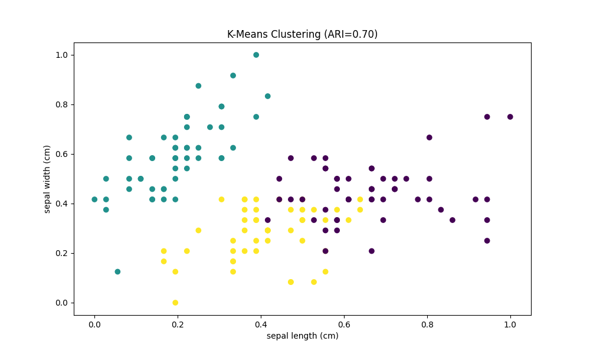

# Task 2: Clustering Analysis Report

**Date**: 2025-08-13 04:54:52  
**Dataset**: Iris (preprocessed)  
**Algorithm**: K-Means Clustering  

## Results Summary
| Metric | Value |
|--------|-------|
| Adjusted Rand Index | 0.70 |
| Silhouette Score | 0.48 |
| Calinski-Harabasz | 351.30 |
| Inertia | 7.12 |

## Interpretation
- **ARI = 0.70**: Good match
- **Silhouette = 0.48**: Weak separation

## Recommendations
1. Use petal measurements as primary clustering features
2. Consider DBSCAN for density-based clustering alternatives
3. Validate with domain experts for biological significance
