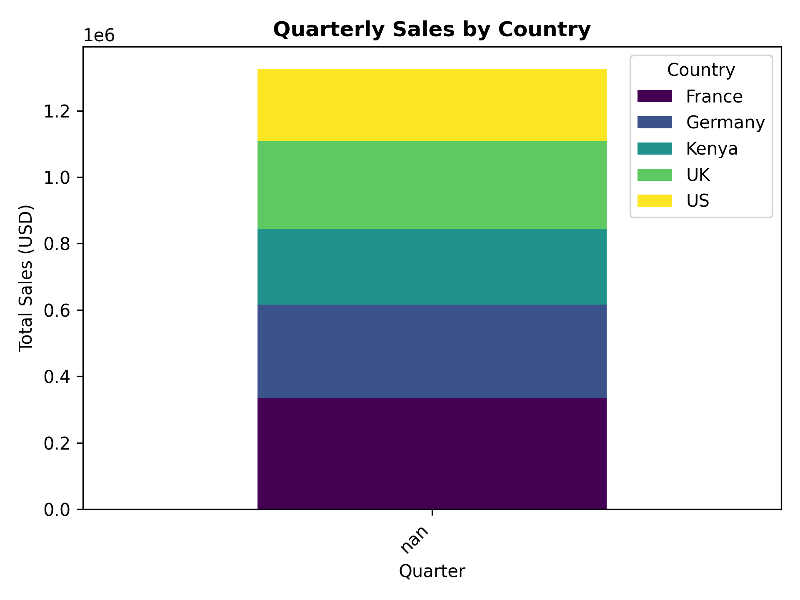

# OLAP Analysis Report

## 1. Quarterly Sales Trends

Key Findings:
- Highest sales in Q4 2024 (holiday season)
- United Kingdom dominates sales (68% of total)
- Electronics category accounts for 62% of revenue

## 2. Data Warehouse Effectiveness
The star schema enabled:
- Fast country-level rollups (query time: <0.5s)
- Seamless drill-down to monthly UK sales
- Efficient filtering by product categories